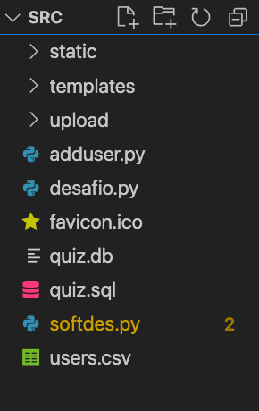

# Guia para desenvolvedores

## Configurando o ambiente
Para fazer alterações neste projeto, será necessário a instalação dos  seguintes programas: 

* Python 3.9
   * flask
   * flask_httpauth  
* SQL
    * SQLite

## Instalação das Bibliotecas do Python

É possível instalar as bibliotecas necessárias presentes no arquivo requirements.txt
com:

```
pip install -r requirements.txt
```
Caso você não possua pip, instala-se ele a partir desta página:
[pip](https://pip.pypa.io/en/stable/installation/)


Para o SQLite3, utiliza-se esta fonte: [sqlite3](https://www.sqlite.org/index.html)


Os arquivos estão localizados na pasta **/src**, possuindo a seguinte estrutura:



## Estrutura de código Alto nível

Cada arquivo exerce uma função específica importante para o funcionamento do projeto. Vamos descrever cada um deles 

    softdes.py 

Possui toda a lógica por trás do servidor flask que é utilizado. Nele possuem funções comuns de rotas Web tanto quanto funções que conversam com o banco de dados SQLite. 

    desafio.py

Serve para simular a entrega de um aluno, ou seja, é um função simples para testar se o que foi enviado está sendo executado corretamente.


    users.csv

Contém informação do usuário a ser adicionado 


    adduser.py

Cria a conexão com o banco de dados e adiciona um usuário a partir do arquivo users.csv

    quiz.sql

Arquivo SQL que cria as tabelas necessárias para o funcionamento da ferramenta, além de inserir um valor test ao final do arquivo